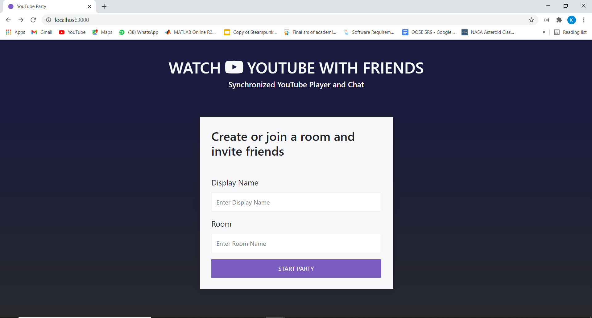
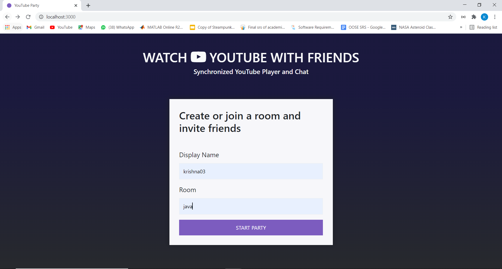
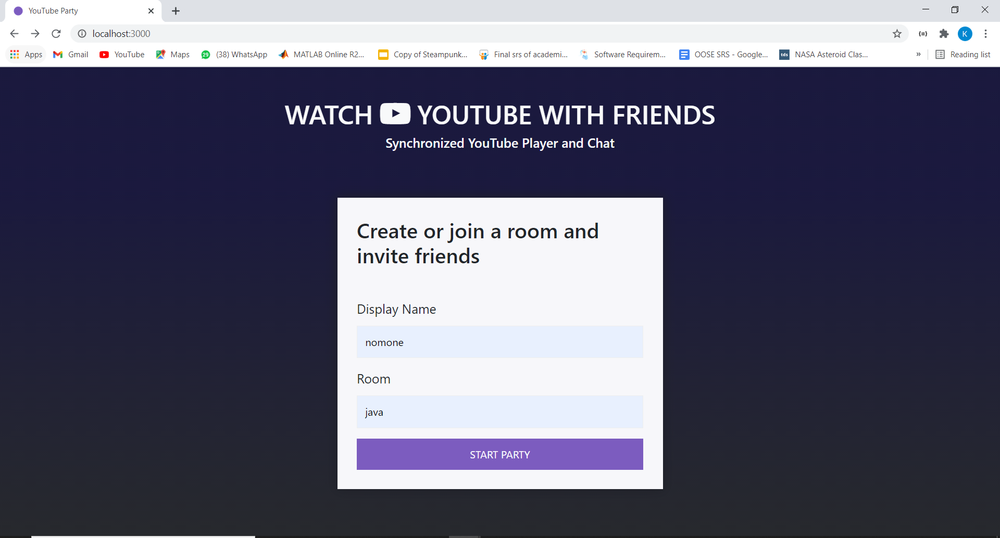
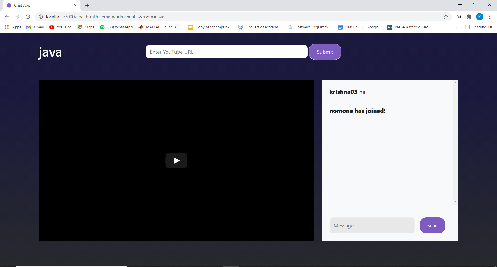
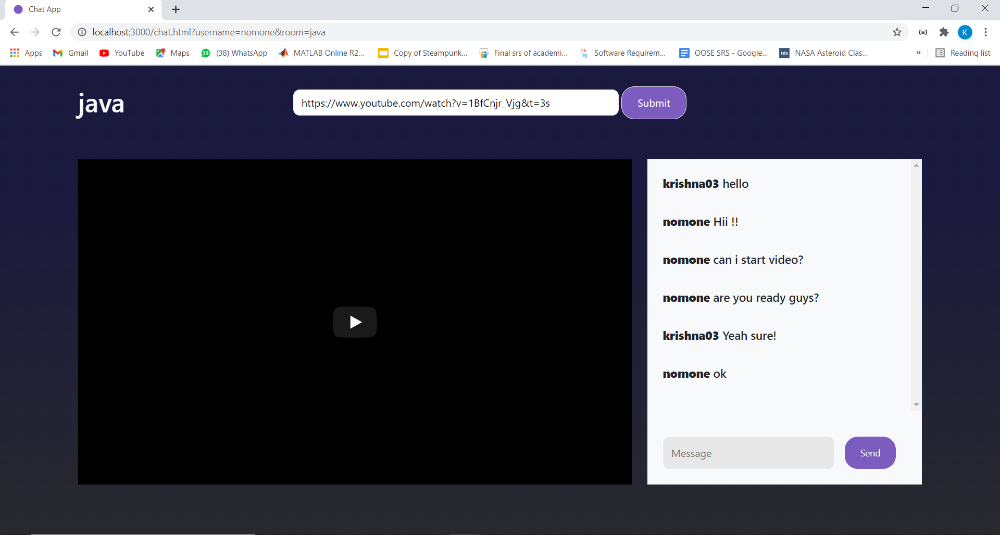
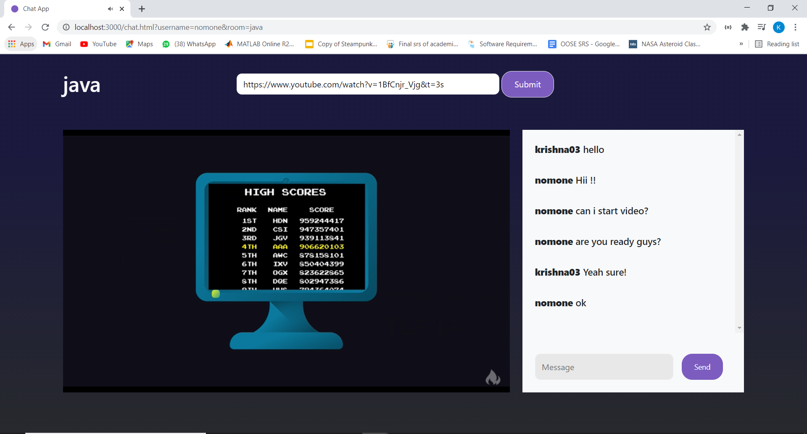
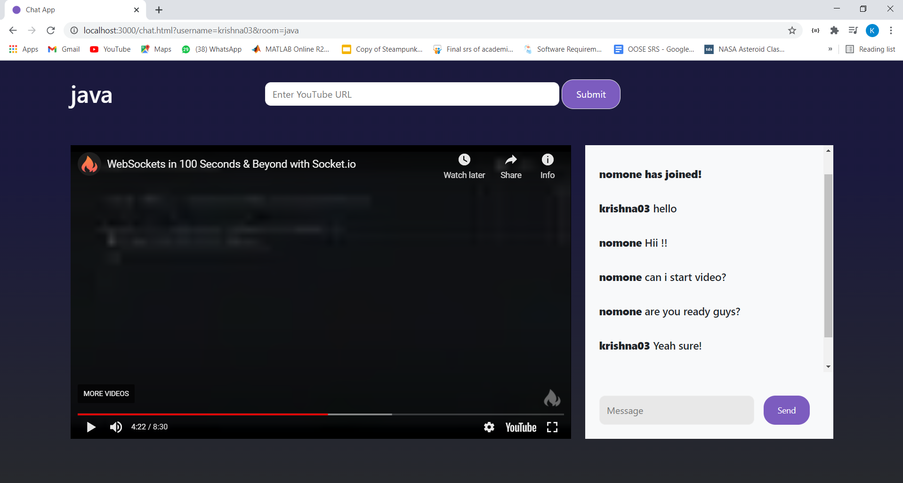
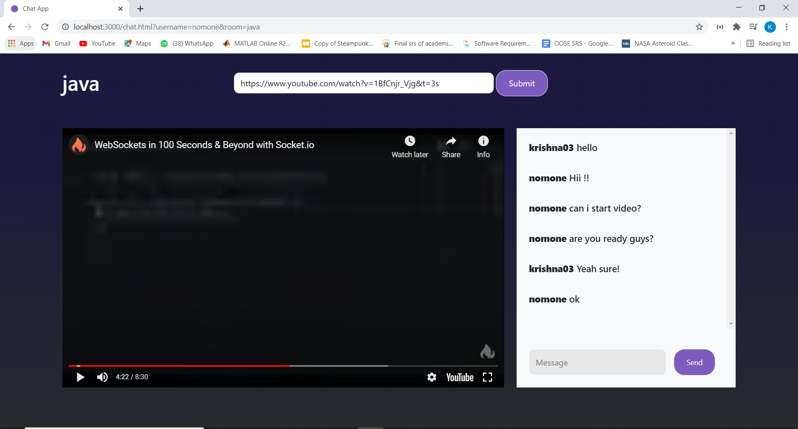

# YouTube Party - KJSCE Hack 2021

[](https://javascript.com "NodeJS")
[](https://javascript.com "Socket.io")

A video synchronization platform just like Netflix Party but for YouTube, where you can watch YouTube videos in real-time with your friends.

You can create a room by entering your display name and room name. Your friends can then join you by entering the same room name. After joining the room, anyone can enter a 
URL for YouTube video in the search bar at the top and that video will start playing in sync with all the participants in the room.

Anyone can play/pause the video or go to any timestamp in the progress bar and it will be refelcted to all the participants. There is also a chat section on the right where you can chat 
with your friends in the room and share your thoughts about the video.

---
## Tech Stack
- Frontend - HTML, CSS, JavaScript, Bootstrap
- Backend - Node JS
- Socket.io

## API
- [YouTube Player API](https://developers.google.com/youtube/iframe_api_reference)

## Requirements

For development, you will only need Node.js and a node global package, Yarn, installed in your environement.

## Things we are yet to complete
- Add playlist feature
- Improve UI
- Randomly generate a room name instead of taking input from user

## Issues that are still not solved
- If the video is running and some new participant joins the room then he/she will not be able to watch the video.
- If the user drags along the progress bar instead of directly going to some timestamp then that change is not reflected.

## Screenshots

<div align="center">
<h4 align="center">Room Joining Page</h4>

<br>
 <h4 align="center">Joining room by providing username and room</h4>

<br>
<h4 align="center">After joining room dashboard</h4>

<br>
<h4 align="center">Other user joining the same room/h4>

<br>
<h4 align="center">When somebody joins the room it displays a message that user has joined the room</h4>

<br>
<h4 align="center">To watch the video, any user in the same room can submit the URL of video and everyone will be able to see that same video in sync</h4>

<br>
<h4 align="center">All users watching the same video with same timestamp</h4>

<br>
  <h4 align="center">If any user changes the timestamp of video then it will reflected to to all the users</h4>

<br>
  <h4 align="center">Playing video with same timestamp to all the users after someone has changed the timestamp of video</h4>

<br>
</div>
 
### Start with cloning this repo on your local machine

```sh
$ git clone https://github.com/ZalakBhojani/Youtube-Party
$ cd YoutTube-Party 
```


### Node
- #### Node installation on Windows

  Just go on [official Node.js website](https://nodejs.org/) and download the installer.
Also, be sure to have `git` available in your PATH, `npm` might need it (You can find git [here](https://git-scm.com/)).

- #### Node installation on Ubuntu

  You can install nodejs and npm easily with apt install, just run the following commands.

      $ sudo apt install nodejs
      $ sudo apt install npm

- #### Other Operating Systems
  You can find more information about the installation on the [official Node.js website](https://nodejs.org/) and the [official NPM website](https://npmjs.org/).

If the installation was successful, you should be able to run the following command.

    $ node --version
    v8.11.3

    $ npm --version
    6.1.0

If you need to update `npm`, you can make it using `npm`! Cool right? After running the following command, just open again the command line and be happy.

    $ npm install npm -g


## To install required npm packages, run:

```sh
$ npm install 
```

## To run the project

```sh
cd src
$ node index.js
```
